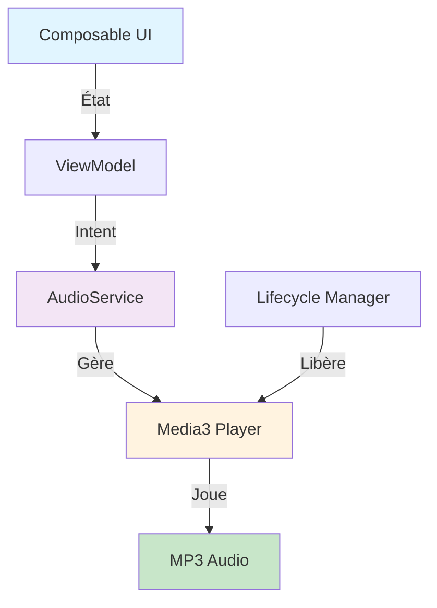

# Gestion audio - Architecture avec Media3

## Contexte

Carnet de Chants utilise **Media3** (anciennement ExoPlayer) pour jouer les MP3 autohosted.

**Avantages Media3 vs MediaPlayer**:
- ✅ API moderne et stable
- ✅ Threading automatique (pas de Handler(Looper) nécessaire!)
- ✅ Gestion robuste des erreurs
- ✅ Recommandé par Google (MediaPlayer est deprecated)
- ✅ Support offline avancé

## Architecture avec Media3



## Implémentation avec Media3

### 0. AudioApiService
```kotlin
class AudioApiService @Inject constructor(
    private val httpClient: HttpClient
) {
    companion object {
        // serveur
        private const val BASE_URL = "https://SITE_MP3/audio/"
    }

fun getAudioUrl(audioFileName: String): String {
    return "$BASE_URL$audioFileName"
}
}
```

### 1. AudioService (Gestion du Player)

```kotlin
@Singleton
class AudioPlayerRepositoryImpl @Inject constructor(
    @ApplicationContext private val context: Context
) : AudioPlayerRepository {

    private var player: ExoPlayer? = null
    private val mainHandler = Handler(Looper.getMainLooper())

    private val _isPlaying = MutableStateFlow(false)
    private val _currentPosition = MutableStateFlow(0L)
    private val _duration = MutableStateFlow(0L)
    private val _buffering = MutableStateFlow(false)
    private val _error = MutableStateFlow<String?>(null)

    override val isPlaying = _isPlaying.asStateFlow()
    override val currentPosition = _currentPosition.asStateFlow()
    override val duration = _duration.asStateFlow()
    override val buffering = _buffering.asStateFlow()
    override val error = _error.asStateFlow()

    private val positionRunnable = object : Runnable {
        override fun run() {
            player?.let {
                if (it.isPlaying) {
                    _currentPosition.value = it.currentPosition
                }
            }
            mainHandler.postDelayed(this, 100)
        }
    }

    private fun getOrCreatePlayer(): ExoPlayer {
        if (player == null) {
            player = ExoPlayer.Builder(context).build().apply {
                addListener(object : Player.Listener {
                    override fun onIsPlayingChanged(isPlaying: Boolean) {
                        android.util.Log.d("AUDIO", "onIsPlayingChanged: $isPlaying")
                        _isPlaying.value = isPlaying
                    }

                    override fun onPlaybackStateChanged(state: Int) {
                        android.util.Log.d("AUDIO", "onPlaybackStateChanged: $state")
                        _buffering.value = (state == Player.STATE_BUFFERING)
                        if (state == Player.STATE_READY) {
                            _duration.value = duration.coerceAtLeast(0L)
                            android.util.Log.d("AUDIO", "Duration set to: ${_duration.value}")
                        }
                    }

                    override fun onPlayerError(error: PlaybackException) {
                        android.util.Log.e("AUDIO", "Player error: ${error.message}")
                        _error.value = "Erreur lecture: ${error.message}"
                    }
                })
            }
            mainHandler.post(positionRunnable)
        }
        return player!!
    }

    override fun prepare(audioUrl: String) {
        android.util.Log.d("AUDIO", "prepare() called with URL: $audioUrl")

        _currentPosition.value = 0L
        _duration.value = 0L
        _isPlaying.value = false
        _buffering.value = false
        _error.value = null

        val p = getOrCreatePlayer()
        p.clearMediaItems()
        p.setMediaItem(MediaItem.fromUri(audioUrl))
        p.prepare()

        android.util.Log.d("AUDIO", "Player state after prepare: ${p.playbackState}")
    }

    override fun play() {
        player?.play()
    }

    override fun pause() {
        player?.pause()
    }

    override fun stop() {
        player?.let {
            it.pause()
            it.seekTo(0)
        }
        _currentPosition.value = 0L
        _isPlaying.value = false
    }

    override fun seekTo(position: Long) {
        player?.seekTo(position)
    }

    override fun release() {
        mainHandler.removeCallbacks(positionRunnable)
        player?.release()
        player = null
    }
}
```

### 2. ViewModel avec État Audio

```kotlin
data class PlayerState(
    val isPrepared: Boolean = false,
    val isPlaying: Boolean = false,
    val currentPosition: Long = 0L,
    val duration: Long = 0L,
    val isBuffering: Boolean = false,
    val error: String? = null,
    val songTitle: String = ""
)


@HiltViewModel
class SongDetailViewModel @Inject constructor(
    private val getSongByIdUseCase: GetSongByIdUseCase,
    private val audioRepository: AudioPlayerRepository
) : ViewModel() {

    private val _uiState = MutableStateFlow<SongDetailUiState>(SongDetailUiState.Loading)
    val uiState = _uiState.asStateFlow()

    val playerState: StateFlow<PlayerState> = combine(
        audioRepository.isPlaying,
        audioRepository.currentPosition,
        audioRepository.duration,
        audioRepository.buffering,
        audioRepository.error
    ) { isPlaying, position, duration, buffering, error ->
        PlayerState(
            isPrepared = duration > 0,
            isPlaying = isPlaying,
            currentPosition = position,
            duration = duration,
            isBuffering = buffering,
            error = error,
            songTitle = (_uiState.value as? SongDetailUiState.Success)?.song?.title ?: ""
        )
    }.stateIn(viewModelScope, SharingStarted.WhileSubscribed(5000), PlayerState())

    fun loadSong(songId: String) {
        viewModelScope.launch {
            getSongByIdUseCase(songId)
                .catch { _uiState.value = SongDetailUiState.Error(it.message ?: "Erreur inconnue") }
                .collect { song ->
                    if (song != null) {
                        _uiState.value = SongDetailUiState.Success(song)
                    } else {
                        _uiState.value = SongDetailUiState.Error("Chant introuvable")

                    }
                }
        }
    }

    fun prepareAudio(song: Song) {
        song.audioUrl?.let { url ->
            audioRepository.prepare(url)
        }
    }

    fun togglePlayPause() {
        if (audioRepository.isPlaying.value) {
            audioRepository.pause()
        } else {
            audioRepository.play()
        }
    }

    fun seekTo(position: Long) {
        audioRepository.seekTo(position)
    }

    fun stopAudio() {
        audioRepository.stop()
    }

    override fun onCleared() {
        super.onCleared()
        audioRepository.release()
    }
}
```

### 3. Composable UI

```kotlin
@Composable
fun SongDetailContent(
    modifier: Modifier = Modifier,
    uiState: SongDetailUiState,
    playerState: PlayerState,
    onBackClick: () -> Unit,
    onPrepareAudio: (Song) -> Unit,
    onTogglePlayPause: () -> Unit,
    onSeek: (Long) -> Unit,
    onStop: () -> Unit
) {
// État du BottomSheet
    val sheetState = rememberModalBottomSheetState(
        skipPartiallyExpanded = true // Commence directement ouvert à 100%
    )
    var showBottomSheet by remember { mutableStateOf(false) }
    var showControls by remember { mutableStateOf(false) }

    Scaffold(
        topBar = {
            TopAppBar(
                title = {
                    //Text("Détail du chant")
                    Text(
                        text = when (uiState) {
                            is SongDetailUiState.Success -> uiState.song.title
                            else -> "détail du chant"
                        },
                        maxLines = 1,
                        style = MaterialTheme.typography.titleLarge,
                        color = MaterialTheme.colorScheme.onPrimaryContainer
                    )
                },
                navigationIcon = {
                    IconButton(onClick = onBackClick) {
                        Icon(
                            imageVector = Icons.AutoMirrored.Filled.ArrowBack,
                            contentDescription = "Retour"
                        )
                    }
                },
                colors = TopAppBarDefaults.topAppBarColors(
                    containerColor = MaterialTheme.colorScheme.primaryContainer,
                    titleContentColor = MaterialTheme.colorScheme.onPrimaryContainer
                )
            )
        },
        bottomBar = {
            // Mini player toujours visible en bas
            if (playerState.isPrepared) {
                MiniPlayer(
                    isPlaying = playerState.isPlaying,
                    title = playerState.songTitle,
                    onPlayPause = { onTogglePlayPause() },
                    onExpand = { showControls = true },
                    modifier = Modifier.fillMaxWidth()
                )
            }
        }
    ) { padding ->
        when (val state = uiState) {
            is SongDetailUiState.Loading -> {
                Box(
                    modifier = Modifier.fillMaxSize(),
                    contentAlignment = Alignment.Center
                ) {
                    CircularProgressIndicator()
                }
            }

            is SongDetailUiState.Error -> {
                ErrorContent(
                    message = state.message,
                    modifier = Modifier.padding(padding)
                )
            }

            is SongDetailUiState.Success -> {
                val song = state.song

                Column(
                    modifier = Modifier
                        .fillMaxSize()
                        .padding(padding)
                        .verticalScroll(rememberScrollState())
                ) {
                    // En-tête du chant
                    SongHeader(song = song)

                    // Bouton Écouter
                    ListenButton(
                        onClick = {
                            onPrepareAudio(song)
                            showControls = true
                        },
                        isLoading = playerState.isBuffering,
                        enabled = song.audioUrl != null
                    )

                    if (song.audioUrl == null) {
                        Text(
                            text = "Audio non disponible",
                            style = MaterialTheme.typography.bodySmall,
                            color = MaterialTheme.colorScheme.error,
                            modifier = Modifier.padding(horizontal = 16.dp)
                        )
                    }

                    Spacer(modifier = Modifier.height(16.dp))

                    // Paroles (toujours visibles)
                    LyricsSection(
                        lyrics = song.lyrics,
                    )

                    // Espace pour le player
                    Spacer(modifier = Modifier.height(32.dp))
                }
            }
        }
    }

// BottomSheet avec contrôles
    if (showControls) {
        ModalBottomSheet(
            onDismissRequest = { showControls = false },
            sheetState = sheetState
        ) {
            FullPlayerControls(
                state = playerState,
                onPlayPause = { onTogglePlayPause() },
                onSeek = { onSeek(it) },
                onStop = {
                    onStop()
                    showControls = false
                }
            )
        }
    }
}

// Mini player compact (toujours visible)
@Composable
private fun MiniPlayer(
    isPlaying: Boolean,
    title: String,
    onPlayPause: () -> Unit,
    onExpand: () -> Unit,
    modifier: Modifier = Modifier
) {
    Surface(
        tonalElevation = 8.dp,
        modifier = modifier
    ) {
        Row(
            modifier = Modifier
                .fillMaxWidth()
                .padding(horizontal = 16.dp, vertical = 12.dp),
            verticalAlignment = Alignment.CenterVertically
        ) {
            IconButton(onClick = onPlayPause) {
                Icon(
                    imageVector = if (isPlaying) Icons.Default.Pause else Icons.Default.PlayArrow,
                    contentDescription = if (isPlaying) "Pause" else "Lecture"
                )
            }

            Column(
                modifier = Modifier
                    .weight(1f)
                    .padding(horizontal = 12.dp)
            ) {
                Text(
                    text = "Lecture en cours",
                    style = MaterialTheme.typography.labelSmall,
                    color = MaterialTheme.colorScheme.primary
                )
                Text(
                    text = title,
                    style = MaterialTheme.typography.bodyMedium,
                    maxLines = 1
                )
            }

            IconButton(onClick = onExpand) {
                Icon(Icons.Default.ExpandLess, "Agrandir")
            }
        }
    }
}

// Contrôles complets (BottomSheet)
@Composable
private fun FullPlayerControls(
    state: PlayerState,
    onPlayPause: () -> Unit,
    onSeek: (Long) -> Unit,
    onStop: () -> Unit
) {
    Column(
        modifier = Modifier
            .fillMaxWidth()
            .padding(24.dp)
    ) {
        Text(
            text = state.songTitle,
            style = MaterialTheme.typography.titleLarge,
            modifier = Modifier.padding(bottom = 24.dp)
        )

        // Barre de progression
        Slider(
            value = state.currentPosition.toFloat(),
            onValueChange = { onSeek(it.toLong()) },
            valueRange = 0f..state.duration.toFloat().coerceAtLeast(1f),
            modifier = Modifier.fillMaxWidth()
        )

        Row(
            modifier = Modifier.fillMaxWidth(),
            horizontalArrangement = Arrangement.SpaceBetween
        ) {
            Text(formatTime(state.currentPosition))
            Text(formatTime(state.duration))
        }

        Spacer(modifier = Modifier.height(24.dp))

        // Boutons principaux
        Row(
            modifier = Modifier.fillMaxWidth(),
            horizontalArrangement = Arrangement.SpaceEvenly,
            verticalAlignment = Alignment.CenterVertically
        ) {
            // Recul 10s
            IconButton(onClick = { onSeek((state.currentPosition - 10000).coerceAtLeast(0)) }) {
                Icon(Icons.Default.Replay10, "Recul 10s")
            }

            // Play/Pause (bouton principal)
            FilledIconButton(
                onClick = onPlayPause,
                modifier = Modifier.size(64.dp)
            ) {
                Icon(
                    imageVector = if (state.isPlaying) Icons.Default.Pause else Icons.Default.PlayArrow,
                    contentDescription = null,
                    modifier = Modifier.size(32.dp)
                )
            }

            // Avance 10s
            IconButton(onClick = { onSeek((state.currentPosition + 10000).coerceAtMost(state.duration)) }) {
                Icon(Icons.Default.Forward10, "Avance 10s")
            }
        }

        Spacer(modifier = Modifier.height(16.dp))

        // Stop
        OutlinedButton(
            onClick = onStop,
            modifier = Modifier.align(Alignment.CenterHorizontally)
        ) {
            Icon(Icons.Default.Stop, null)
            Spacer(Modifier.width(8.dp))
            Text("Arrêter")
        }

        if (state.isBuffering) {
            LinearProgressIndicator(
                modifier = Modifier
                    .fillMaxWidth()
                    .padding(top = 16.dp)
            )
        }
    }
}

private fun formatTime(ms: Long): String {
    val seconds = (ms / 1000) % 60
    val minutes = (ms / 1000 / 60)
    return "%d:%02d".format(minutes, seconds)
}

@Composable
private fun SongHeader(song: Song) {
    Column(
        modifier = Modifier
            .fillMaxWidth()
            .padding(16.dp)
    ) {
        // -- infos song --
        Text(
            text = "${song.songbook} n°${song.number} | ${song.categories.joinToString { it.libelle }}",
            style = MaterialTheme.typography.labelMedium,
            color = MaterialTheme.colorScheme.primary
        )
    }
}

@Composable
private fun ListenButton(
    onClick: () -> Unit,
    isLoading: Boolean,
    enabled: Boolean
) {
    val containerColor = if (enabled) {
        MaterialTheme.colorScheme.primaryContainer
    } else {
        MaterialTheme.colorScheme.surfaceVariant
    }

    Button(
        onClick = onClick,
        enabled = enabled,
        modifier = Modifier
            .fillMaxWidth()
            .padding(horizontal = 16.dp),
        contentPadding = PaddingValues(vertical = 8.dp),
        colors = ButtonDefaults.buttonColors(
            containerColor = containerColor,
            contentColor = MaterialTheme.colorScheme.onPrimaryContainer
        )
    ) {
        Icon(
            imageVector = Icons.Default.PlayCircle,
            contentDescription = null,
            modifier = Modifier.size(28.dp)
        )
        Spacer(modifier = Modifier.width(12.dp))
        Text(
            text = if (enabled) "Écouter le chant" else "Aucun lien audio disponible",
            style = MaterialTheme.typography.titleMedium
        )
    }
}
```

## Hilt Configuration

```kotlin
@Module
@InstallIn(SingletonComponent::class)
abstract class AudioModule {

    @Binds
    @Singleton
    abstract fun bindAudioPlayerRepository(
        impl: AudioPlayerRepositoryImpl
    ): AudioPlayerRepository
}
```

## Avantages de Media3

| Aspect | MediaPlayer | Media3 |
|--------|-----------|--------|
| Threading | ❌ Manuel | ✅ Auto |
| Erreurs | ❌ Basique | ✅ Robuste |
| Offline | ❌ Limité | ✅ Avancé |
| Support | ⚠️ Deprecated | ✅ Maintenu |

## Permissions AndroidManifest.xml

```xml
<uses-permission android:name="android.permission.INTERNET" />
```

## Dépendances

Dans `libs.versions.toml`:
```toml
media3 = "1.9.2"
```

Dans `build.gradle.kts`:
```kotlin
implementation(libs.media3)
```

---

**Voir aussi**: 
- [Dépendances](../setup/dependances.md)
- [Architecture Vue d'ensemble](vue-ensemble.md)
