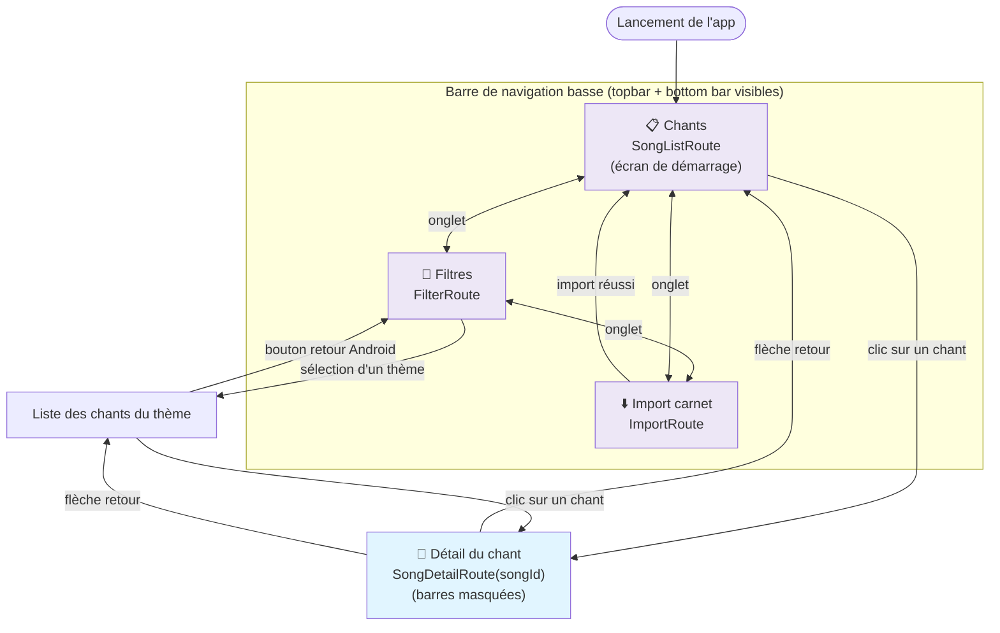

# Navigation

## Flux entre les écrans

L'application repose sur `NavHost` (Navigation Compose) avec 4 routes typées définies dans
[`Routes.kt`](https://github.com/epechassieu/carnet-de-chant/blob/main/app/src/main/java/fr/epechassieu/carnetdechant/ui/navigation/Routes.kt) :
`SongListRoute`, `FilterRoute`, `ImportRoute` et `SongDetailRoute(songId)`.

La barre de navigation basse (3 onglets) et la topbar ne sont affichées que sur les 3 routes
principales — elles disparaissent sur l'écran de détail d'un chant.

## Détails par route

- **SongListRoute** — écran de démarrage. Recherche "contains" par nom/numéro, clic sur un
  chant → `SongDetailRoute`.
- **FilterRoute** — grille des catégories, puis liste filtrée. Le bouton retour Android est
  intercepté (`BackHandler`) pour revenir à la grille plutôt que quitter l'écran.
- **ImportRoute** — télécharge `chants.json` + les mp3 associés. En cas de succès, navigue
  automatiquement vers `SongListRoute` en dépilant `ImportRoute` (`popUpTo(ImportRoute) { inclusive = true }`).
- **SongDetailRoute(songId)** — affiche paroles + lecteur audio (Media3). N'affiche pas la
  topbar/bottom bar ; le retour dépile simplement la pile de navigation.
