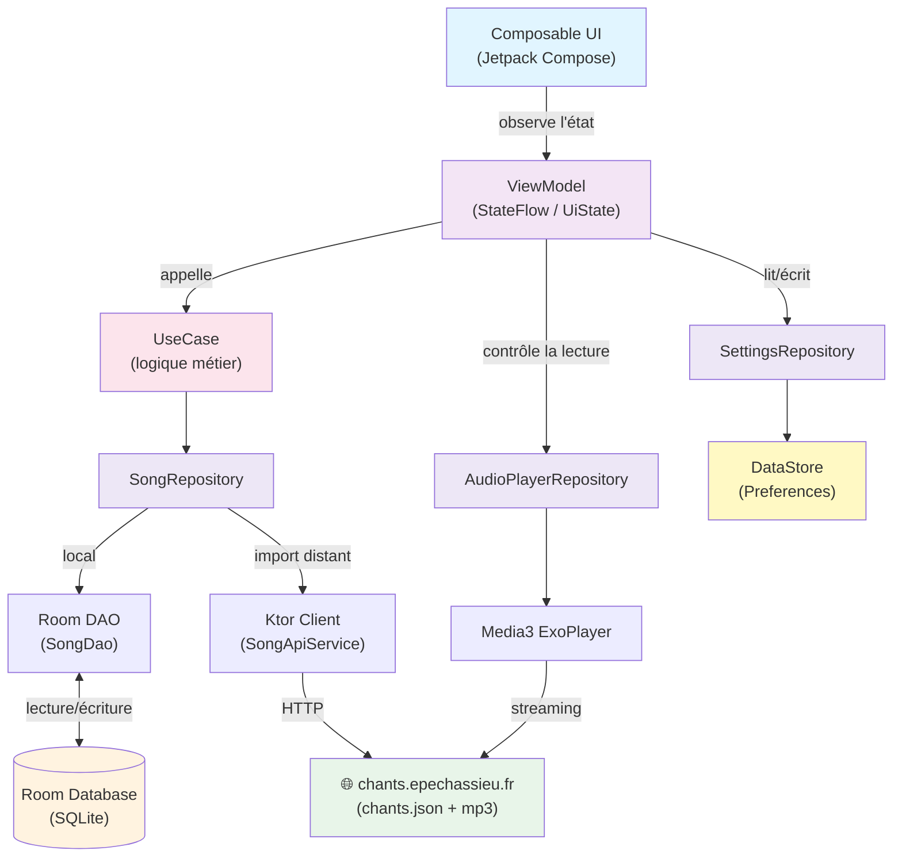

# Architecture - Vue d'ensemble

## Stack technique

- **SongRepository** : chants (Room en local, JSON distant pour l'import).
- **AudioPlayerRepository** : pilote Media3 ExoPlayer pour la lecture des mp3.
- **SettingsRepository** : préférences utilisateur (ex. taille du texte), persistées via DataStore.